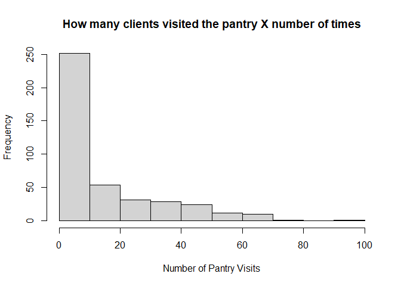
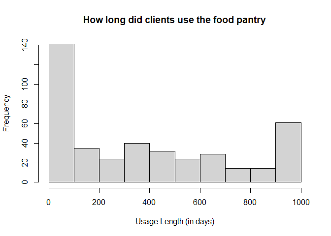
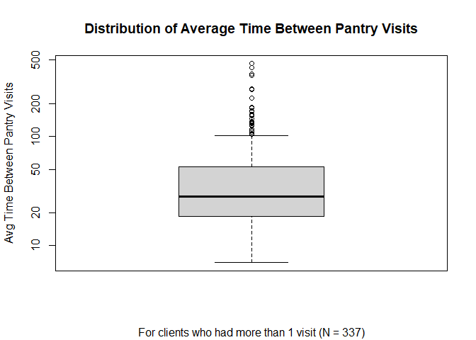

Food Pantry Utilization
=======================

    ## -- Attaching packages --------------------------------------- tidyverse 1.3.0 --

    ## v ggplot2 3.3.3     v purrr   0.3.4
    ## v tibble  3.0.1     v dplyr   1.0.3
    ## v tidyr   1.0.3     v stringr 1.4.0
    ## v readr   1.4.0     v forcats 0.5.0

    ## -- Conflicts ------------------------------------------ tidyverse_conflicts() --
    ## x dplyr::filter() masks stats::filter()
    ## x dplyr::lag()    masks stats::lag()

    ## 
    ## Attaching package: 'lubridate'

    ## The following objects are masked from 'package:base':
    ## 
    ##     date, intersect, setdiff, union

Some Clients Have Multiple Entries Logged for the Same Date
-----------------------------------------------------------

There may be some duplicate records in the food pantry data. However,
it’s possible this data is genuine because a client may have picked up
multiple bags in one visit and it was documented as separate records.

Regardless, it’s possible the duplicate records don’t really matter if
we focus on the number of visits (distinct dates) and when they ocurred.

    # records with duplicates
    duplicates <- pantry[duplicated(pantry),] 

    # there are 132 records that have at least one duplicate of itself
    nrow(duplicates)

    ## [1] 132

    # if we were to drop the duplicates, we would drop 2.1% of the data
    1-nrow(unique(pantry))/nrow(pantry)

    ## [1] 0.02104256

    # 12 clients have duplicate records
    length(unique(duplicates$anon_ID))

    ## [1] 12

    # clients impacted:
    unique(duplicates$anon_ID)

    ##  [1] 361  15 607 358 139 476 475 191 103 639  99 575

    # for reference there are 414 unique clients with pantry data
    length(unique(pantry$anon_ID))

    ## [1] 414

    #as an example of some duplicates for anon_ID 15
    # it looks like all records were there twice 
    filter(pantry, anon_ID == "15") %>% arrange(assistance_date) %>% head(10)

    ##    anon_ID  assistance_date               assistance_category amount   unit
    ## 1       15  1/12/2021 10:42 Food Pantry: Food Pantry Poundage     25 Pounds
    ## 2       15  1/12/2021 10:42 Food Pantry: Food Pantry Poundage     25 Pounds
    ## 3       15  1/15/2019 16:00      Food Pantry: Holiday Baskets     30 Pounds
    ## 4       15  1/15/2019 16:00      Food Pantry: Holiday Baskets     30 Pounds
    ## 5       15   1/2/2020 14:11 Food Pantry: Food Pantry Poundage     25 Pounds
    ## 6       15   1/2/2020 14:11 Food Pantry: Food Pantry Poundage     25 Pounds
    ## 7       15  1/26/2021 10:30 Food Pantry: Food Pantry Poundage     25 Pounds
    ## 8       15  1/26/2021 10:30 Food Pantry: Food Pantry Poundage     25 Pounds
    ## 9       15 10/10/2019 14:24 Food Pantry: Food Pantry Poundage     25 Pounds
    ## 10      15 10/10/2019 14:24 Food Pantry: Food Pantry Poundage     25 Pounds

    # change date to date type
    pantry <- pantry %>%
      mutate(assistance_date = as.Date(assistance_date, "%m/%d/%Y %H:%M")) 

How often do clients visit the food pantry?
===========================================

18.6% of clients who visited the food pantry at all only visited once.  
42.27% of clients who visited the food pantry went at least 10 times.

    # creating a table organized by client
    pantry_by_client <- pantry %>%
      group_by(anon_ID) %>%
      summarise(
        num_visits = length(unique(assistance_date)), 
        first_visit = min(assistance_date),
        last_visit = max(assistance_date)
      ) 

    # plot
    hist(pantry_by_client$num_visits,
         xlab = "Number of Pantry Visits",
         main = "How many clients visited the pantry X number of times")

    # % visited more than 10 times
    nrow(pantry_by_client %>% filter(num_visits >= 10))/nrow(pantry_by_client)

    ## [1] 0.4227053

    # % visited only 1 time
    nrow(pantry_by_client %>% filter(num_visits == 1))/nrow(pantry_by_client)

    ## [1] 0.1859903

How long did clients use the food pantry?
=========================================

Histogram of total length of time clients used the food pantry (last
visit - first visit)

Since our data is limited, it’s possible that this is an
underrepresentation of total duration.

    # getting total duration of pantry usage per client
    pantry_by_client <- pantry_by_client %>%
      mutate(usage_length =  as.numeric(difftime(last_visit, first_visit, units = "days")))

    # plot
    hist(pantry_by_client$usage_length,
         main = "How long did clients use the food pantry",
         xlab = "Usage Length (in days)")

\# Time in Between Pantry visits

For clients who visited more than once, most of them visited the pantry
within two months of their last visit on average.

I found the length of time since the previous visit for each visit.
Then, grouping by client, I found the average time between visits.

    # creates a table to get avg time b/w visits
    avg_time_between_visits <- unique(pantry) %>% # remove duplicate rows 
      group_by(anon_ID)%>%  
      arrange(anon_ID, assistance_date) %>%
      filter(n() > 1) %>%
      mutate(Difference = difftime(assistance_date, lag(assistance_date), units = "days") )  %>%
      summarize(mean_time = mean(Difference, na.rm=TRUE)) 

    # plot
    boxplot(as.numeric(avg_time_between_visits$mean_time), 
            log = "y",
            main = "Distribution of Average Time Between Pantry Visits",
            ylab = "Avg Time Between Pantry Visits",
            sub = "For clients who had more than 1 visit (N = 337)")

Poverty data
============

68.36% of clients who used the food pantry were in poverty

    length(unique(pantry$anon_ID)) # unique food pantry clients

    ## [1] 414

    pantry <- merge(pantry, client_data, by = "anon_ID", all.x = TRUE)

    pantry_in_poverty = filter(pantry, poverty == "Yes")

    length(unique(pantry_in_poverty$anon_ID)) # 283 food pantry clients in poverty

    ## [1] 283

    283/414

    ## [1] 0.6835749
